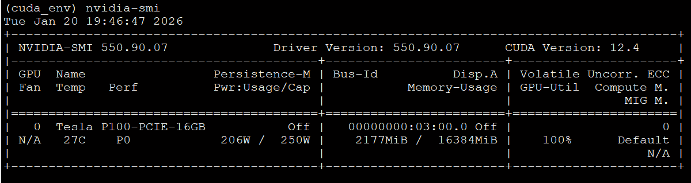

# CUDA Matrix Multiplication - Phase 3: Batched GEMM

Multiple matrix multiplications in a single kernel launch for neural networks and parallel workloads.


## Performance Highlights

| Metric                          | Value                                      |
|---------------------------------|--------------------------------------------|
| **Peak Performance**            | 6,589.87 GFLOPS (71% theoretical peak)     |
| **Best Speedup**                | 5.75× vs naive loop (small matrices)       |
| **Register Blocked Speedup**    | 3.32–4.01× (large matrices)                |
| **Launch Overhead Eliminated**  | 32 launches → 1 launch                     |

## Key Concept

```
Traditional (batch of 32):          Batched GEMM:
  Launch kernel 0  -> 7us overhead     Launch single kernel -> 7us overhead
  Launch kernel 1  -> 7us overhead     (processes all 32 matrices)
  ...                                 
  Launch kernel 31 -> 7us overhead     
  -----------------------------       -----------------------------
  Total: 32 x 7us = 224us overhead    Total: 7us overhead (32x less!)
```

## Quick Start

### Compile

```bash
nvcc -O3 -arch=sm_60 -o matmul_batched src/matmul_batched.cu
```

### Run

```bash
# Transformer attention heads (8 heads, 64x64 matrices)
./matmul_batched 64 64 64 8

# Neural network batch (32 samples, 256x256 layer)
./matmul_batched 256 256 256 32

# Large-scale workload (transformer-like)
./matmul_batched 1024 2048 3072 32
```

---

## Benchmark Results (Tesla P100)

### Test 1: Small Matrices (64x64, batch=8)

**Use case:** Transformer attention heads

```
Configuration:
  Matrix size: C(64x64) = A(64x64) x B(64x64)
  Batch size: 8
  Total FLOPs: 4.19e+06

Performance:
  Naive Loop (8 launches)        :    0.039 ms,   106.29 GFLOPS
  Batched Basic (1 launch)       :    0.007 ms,   611.06 GFLOPS  <- Best
  Batched + Register Blocked     :    0.010 ms,   414.00 GFLOPS
  Batched + Mixed Precision      :    0.008 ms,   524.08 GFLOPS
  Batched + Mixed + RegBlock     :    0.012 ms,   362.88 GFLOPS

Speedup vs Naive Loop:
  Batched Basic:           5.75x  <- Best for small matrices
  Batched + RegBlock:      3.89x
  Batched + Mixed:         4.93x
```

**Key Insight:** For small matrices, kernel launch overhead dominates. Simple batching provides the best speedup (5.75x).

---

### Test 2: Medium Matrices (256x256, batch=32)

**Use case:** Neural network layer batch processing

```
Configuration:
  Matrix size: C(256x256) = A(256x256) x B(256x256)
  Batch size: 32
  Total FLOPs: 1.07e+09

Performance:
  Naive Loop (32 launches)       :    0.856 ms,  1253.66 GFLOPS
  Batched Basic (1 launch)       :    0.696 ms,  1543.04 GFLOPS
  Batched + Register Blocked     :    0.213 ms,  5029.74 GFLOPS  <- Best
  Batched + Mixed Precision      :    0.834 ms,  1288.15 GFLOPS
  Batched + Mixed + RegBlock     :    0.276 ms,  3886.13 GFLOPS

Speedup vs Naive Loop:
  Batched Basic:           1.23x
  Batched + RegBlock:      4.01x  <- Register blocking dominates
  Batched + Mixed + Reg:   3.10x
```

**Key Insight:** Register blocking becomes crucial at medium sizes, achieving 4.01x speedup.

---

### Test 3: Rectangular Matrices (128x768x512, batch=32)

**Use case:** Embedding layer / FFN in transformers

```
Configuration:
  Matrix size: C(128x512) = A(128x768) x B(768x512)
  Batch size: 32
  Total FLOPs: 3.22e+09

Performance:
  Naive Loop (32 launches)       :    2.345 ms,  1373.52 GFLOPS
  Batched Basic (1 launch)       :    2.035 ms,  1582.75 GFLOPS
  Batched + Register Blocked     :    0.626 ms,  5144.86 GFLOPS  <- Best
  Batched + Mixed Precision      :    2.391 ms,  1346.97 GFLOPS
  Batched + Mixed + RegBlock     :    0.829 ms,  3887.47 GFLOPS

Speedup vs Naive Loop:
  Batched Basic:           1.15x
  Batched + RegBlock:      3.75x
  Batched + Mixed + Reg:   2.83x
```

**Key Insight:** Rectangular matrices (M!=K!=N) work correctly, demonstrating Phase 1 integration.

---

### Test 4: Large-Scale Workload (1024x2048x3072, batch=32)

**Use case:** Large transformer layer / production workload

```
Configuration:
  Matrix size: C(1024x3072) = A(1024x2048) x B(2048x3072)
  Batch size: 32
  Total FLOPs: 4.12e+11

Memory usage:
  A: 268.44 MB (32 x 1024x2048)
  B: 805.31 MB (32 x 2048x3072)
  C: 402.65 MB (32 x 1024x3072)
  Total: 1476.40 MB

Performance:
  Naive Loop (32 launches)       :  207.955 ms,  1982.72 GFLOPS
  Batched Basic (1 launch)       :  227.413 ms,  1813.07 GFLOPS
  Batched + Register Blocked     :   62.568 ms,  6589.87 GFLOPS  <- PEAK
  Batched + Mixed Precision      :  271.159 ms,  1520.57 GFLOPS
  Batched + Mixed + RegBlock     :   82.769 ms,  4981.52 GFLOPS

Speedup vs Naive Loop:
  Batched + RegBlock:      3.32x
  Batched + Mixed + Reg:   2.51x
```

**Peak Performance: 6,589.87 GFLOPS (71% of theoretical 9,300 GFLOPS)**

---

## GPU Utilization During Large Workload

nvidia-smi output during `./matmul_batched 1024 2048 3072 32`:



**Key metrics:**
- GPU Utilization: 100%
- Power Draw: 206W / 250W (82% TDP)
- Memory Used: 2,177 MiB / 16,384 MiB (13%)
- Temperature: 27C (excellent cooling)

---

## Performance Summary

| Test Configuration        | Best Kernel           | GFLOPS  | Speedup |
|---------------------------|-----------------------|---------|---------|
| 64×64×64, batch=8         | Batched Basic         | 611     | 5.75×   |
| 256×256×256, batch=32     | Batched + RegBlock    | 5,030   | 4.01×   |
| 128×768×512, batch=32     | Batched + RegBlock    | 5,145   | 3.75×   |
| 1024×2048×3072, batch=32  | Batched + RegBlock    | **6,590** | 3.32×   |

### Performance Scaling

```
Matrix Size vs Performance:

6,590 GFLOPS |                                    ####  1024x2048x3072
             |                              
5,145 GFLOPS |                        ####        128x768x512
5,030 GFLOPS |                  ####              256x256x256
             |            
  611 GFLOPS |      ####                          64x64x64
             |
     0       +--------------------------------------------
                Small          Medium           Large
```

---

## Kernel Variants

| Kernel                                | Description               | Best For                          |
|---------------------------------------|---------------------------|-----------------------------------|
| `batched_gemm_basic`                  | Simple batched            | Small matrices (launch overhead)  |
| `batched_gemm_register_blocked`       | + Register blocking       | **Large matrices (compute-bound)**|
| `batched_gemm_mixed_precision`        | + FP16/FP32               | Memory-bound workloads            |
| `batched_gemm_mixed_register_blocked` | All optimizations         | Balanced workloads                |
| `batched_gemm_pointer_array`          | Non-contiguous memory     | Flexible layouts                  |

### When to Use Each Kernel

```
Matrix Size        Best Kernel              Why
-----------------------------------------------------------------
< 128x128          Batched Basic            Launch overhead dominates
128-512            Batched + RegBlock       Computation becomes significant
> 512              Batched + RegBlock       Full GPU utilization
Memory-limited     Batched + Mixed          2x bandwidth from FP16
```

---

## Real-World Applications

### Transformer Self-Attention

```
Multi-head attention with 8 heads:
  Q[h] x K[h]^T  for h = 0..7  ->  Batched GEMM (batch=8)
  Attn[h] x V[h] for h = 0..7  ->  Batched GEMM (batch=8)

Without batching: 16 kernel launches
With batching:    2 kernel launches (8x fewer launches)
```

### Neural Network Batch Processing

```
Batch of 32 images through layer:
  Y[b] = X[b] x W  for b = 0..31

Single batched kernel processes all samples simultaneously
```

---

## Files

```
cuda-matmul-phase3/
|-- README.md                      # This file
|-- src/
|   +-- matmul_batched.cu          # Batched GEMM implementation
|-- docs/
|   +-- PHASE3_BATCHED_GEMM.md     # Detailed documentation
+-- tests/
    +-- test_batched.py            # Python test suite
```

---

## Building on Previous Phases

| Phase   | Feature              | Used in Phase 3                              |
|---------|----------------------|----------------------------------------------|
| Phase 1 | Rectangular matrices | Yes – Supports M≠N≠K                         |
| Phase 2 | Mixed precision      | Yes – FP16 storage, FP32 accumulation        |
| Phase 3 | Batching             | Yes – Single kernel for all matrices         |

---

## Project Progression

```
[x] Phase 1: Rectangular Matrices     Complete (6,436 GFLOPS)
[x] Phase 2: Mixed Precision          Complete (4,731 GFLOPS, 2.6x speedup)
[x] Phase 3: Batched GEMM             Complete (6,590 GFLOPS, 71% peak)
[ ] Phase 4: Tensor Cores             Future (requires Volta+)
[ ] Phase 5: Multi-GPU                Future
```

---

## Hardware

- **GPU**: NVIDIA Tesla P100-PCIE-16GB
- **Architecture**: Pascal (sm_60)
- **CUDA Cores**: 3,584
- **Memory**: 16GB HBM2
- **Theoretical Peak**: 9,300 GFLOPS (FP32)
- **Driver**: 550.90.07
- **CUDA**: 12.4

---

## Author

**Andrey Maltsev**  
GPU Computing & High-Performance Computing

---

## License

MIT License

